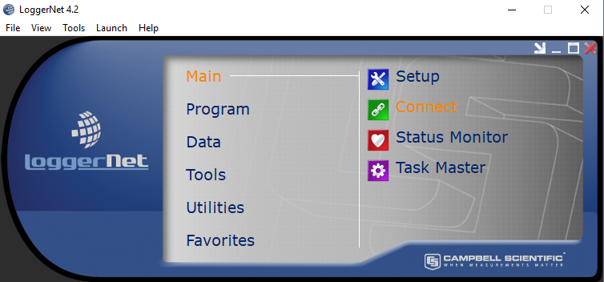

# Daten auslesen

Um Daten vom Datenlogger auszulesen muesst Ihr den Logger mit einem Laptop verbinden. Allerdings braucht der Laptop die Software "LoggerNet", daher braucht Ihr den dafuer vorgesehenen Laptop. Diesen koennt Ihr entweder bei Carsten Staller oder Bastian Paas im Buero abholen.

Um den Laptop mit dem Logger zu verbinden braucht Ihr ein Patchkabel. Das kennen die meisten unter den Begriffen "Netzwerkkabel" oder "LAN-Kabel", da es benutzt wird wenn Ihr euren PC per Kabel ans Internet anschliesst. 

Wenn ihr den Datenlogger und den Laptop verbunden habt koennt ihr auch schon mit Daten auslesen loslegen. 

Dazu oeffnet ihr das Programm LoggerNet. Ihr bekommt eine Menue-Uebersicht in der ihr mehrere Optionen zur Auswahl habt. Unter dem Menüpunkt **Main **klickt ihr nun auf **Connect.**

Im Anschluss daran sollte sich ein neues Fenster \(Connect Screen\) öffnen. Klickt nun oben links auf connect und stellt sicher das bei den **Stations** _CR3000 _und nicht _CR3000\_Seriell _ausgewählt ist. Der Logger sollte nun verbunden sein.

Jetzt klickt ihr auf **Num\_Display** und wählt _Display  1_ aus

Hier findet ihr die Ausgabe aller gemessenen Werte 

Überprüft ob die Werte sinnvoll sind... ... ... ... 

An die vom Logger intern gespeicherten Werte kommt ihr nun mit folgenden Schritten. Schließt oder minimiert das Fenster mit den Ausgabewerten. Jetzt klickt ihr im Connect Screen auf File Control. Jetzt öffnet sich folgendes Fenster: 

Stellt als erstes sicher, dass **CRD** ausgewählt ist und klickt im Anschluss auf **Refresh. **Wählt nun den Datensatz mit dem _**Datum vom Vortag**_ aus und klickt dann Auf **Retrieve**. 

Navigiert nun auf Desktop und dann zum Ordner _U\_Klima\_SS18\_A und klickt speichern. _

Die Datensatz befindet sich nun im richtigen Ordner und ihr seid fertig. 

