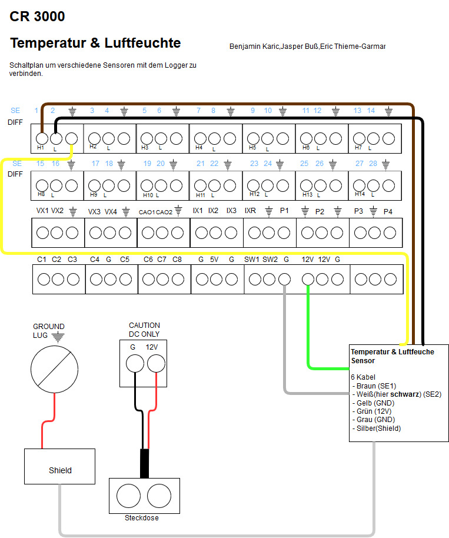
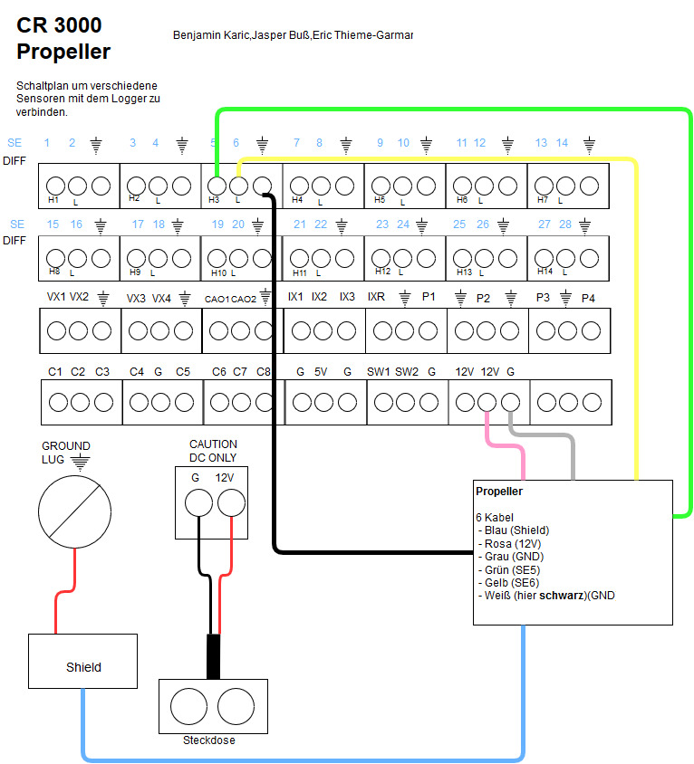
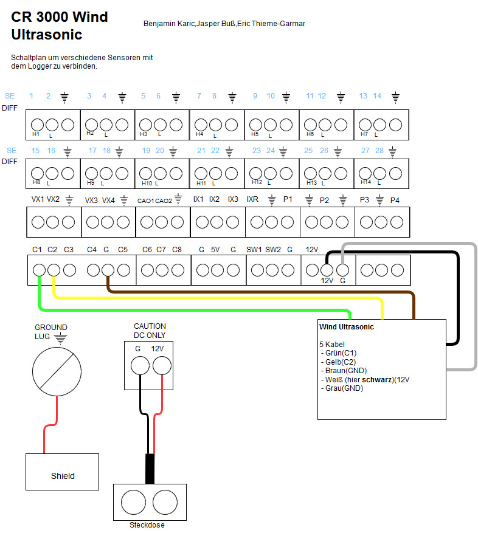
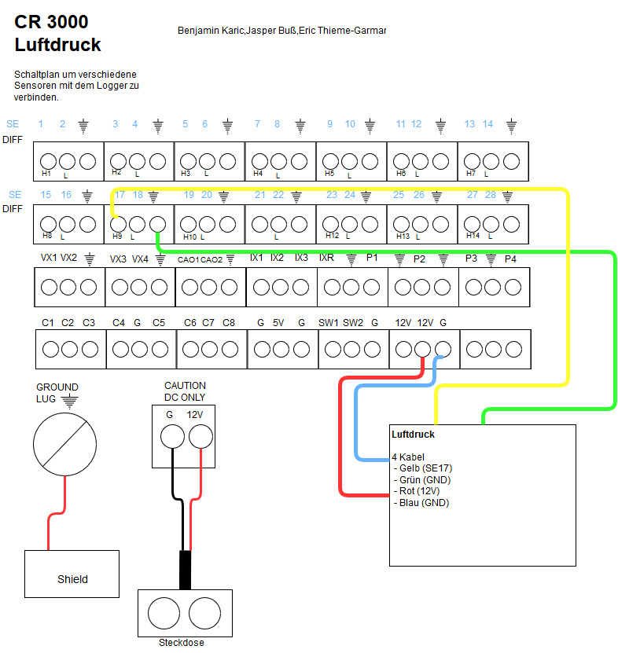
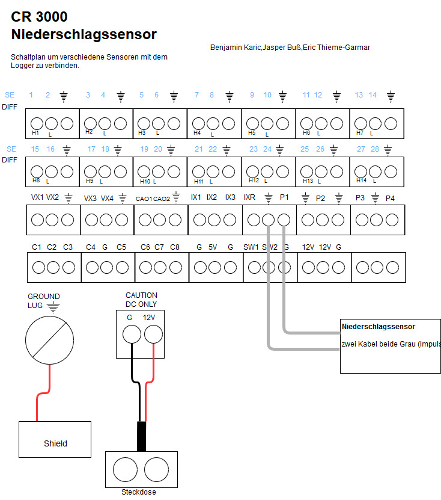
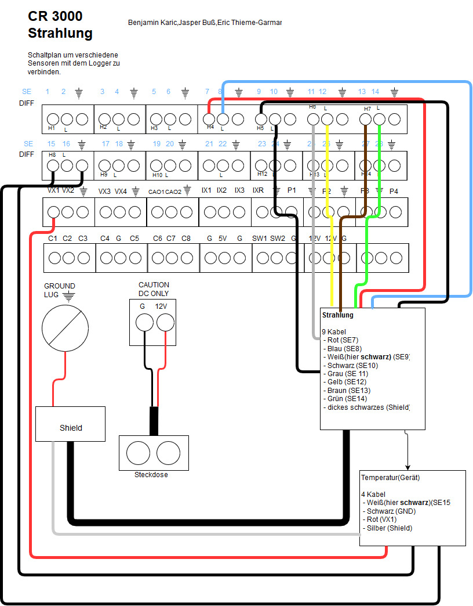

# Schaltpläne

## Die Schaltpläne

Um euch möglichst einfach die Verkablung des Datenloggers mit den Sensoren zu zeigen haben wir für jeden Sensor einen einzelnen Schaltplan erstellt. Dadurch fällt es leichter die Kabel der verschiedenen Sensoren auseinander zu halten und so die Übersicht zu behalten.

#### Temperatur- & Luftfeuchtesensor HC2S3

#### Propelleranemometer

#### Wind Ultrasonic

#### Luftdrucksensor

#### Niederschlagssensor

#### Strahlungssensor

Gibt ein Sensor keine Werte aus? Ist vielleicht ein Kabel locker oder sogar gar nicht angeschlossen? Prüfe mit Hilfe der Schaltpläne, ob alle Kabel richtig angeschlossen sind und schließe ggf. lose Kabel wieder neue an.


Aber Vorsicht! Bevor du mit dem Verkabeln startest gehe sicher, dass Du die Schaltpläne kennst und wirklich weißt wo du die Kabel anschließen musst!


